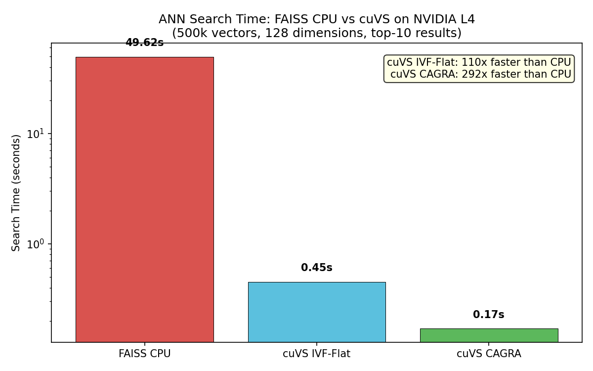
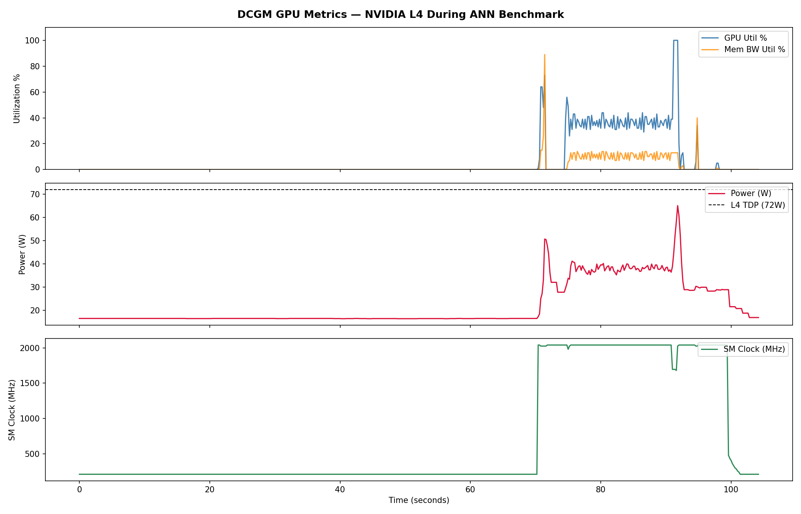

# GPU Performance Analysis: cuVS ANN Search on NVIDIA L4

**Tools:** NVIDIA DCGM · cuVS · FAISS · Python · GCP (NVIDIA L4 GPU)

---

## Overview

This project uses **NVIDIA DCGM (Data Center GPU Manager)** to monitor and analyze GPU behavior in real time while running vector similarity search — the core operation powering AI search, recommendation systems, and RAG pipelines.

Think of DCGM as a heart rate monitor for the GPU. While the benchmark runs, DCGM records utilization, memory bandwidth, power draw, and clock speed every 200ms. The goal is to identify where the hardware is the bottleneck and why.

Three implementations are compared on a 500,000-vector dataset:
- **FAISS CPU** — industry-standard CPU-based approach (baseline)
- **cuVS IVF-Flat** — NVIDIA's GPU-accelerated cluster-based search
- **cuVS CAGRA** — NVIDIA's state-of-the-art graph-based ANN algorithm

---

## Background: What is ANN Search?

Approximate Nearest Neighbor (ANN) search answers the following question: "Given a query vector, which vectors in a large database are most similar to it?"*

This is the core operation in:
- **Vector databases** (e.g. Pinecone)
- **RAG pipelines** — retrieving relevant context for LLMs
- **Semantic search** — finding documents by meaning, not keywords
- **Recommendation systems** — finding similar items or users

At small scales, you can brute-force compare every vector. At 500k+ vectors, you need smarter algorithms — and GPUs make those algorithms dramatically faster.

---

## Setup

| Component | Details |
|---|---|
| GPU | NVIDIA L4 |
| Instance | GCP VM |
| DCGM Version | 3.3.9 |
| cuVS Version | 25.02 |
| FAISS Version | 1.9.0 |
| Dataset | 500,000 vectors, 128 dimensions |
| Queries | 10,000 vectors, top-10 results |

---

## Methodology

DCGM was configured to sample 5 GPU metrics at 200ms intervals throughout the entire benchmark run:

| DCGM Field | What It Measures | Importance |
|---|---|---|
| GPUTL | GPU compute utilization % | Are the GPU cores actually working? |
| MCUTL | Memory bandwidth utilization % | Is the bottleneck data movement vs compute? |
| FBUSD | GPU memory used (MB) | How much VRAM does each algorithm need? |
| POWER | Power draw (W) | Is the GPU approaching its thermal limit? |
| SMCLK | SM clock frequency (MHz) | Is the GPU throttling under sustained load? |

The three algorithms were run sequentially with 3-second pauses between each, creating visible boundaries in the DCGM trace.

---

## Results

### Search Time Comparison

| Method | Search Time | Speedup vs CPU |
|---|---|---|
| FAISS CPU | 49.62s | (baseline) |
| cuVS IVF-Flat | 0.45s | **110x** |
| cuVS CAGRA | 0.17s | **292x** |

cuVS CAGRA completes the same search task **292x faster** than CPU-based FAISS. The Y-axis uses a log scale — the performance gap is so large it would be invisible on a linear scale.

---

### DCGM GPU Metrics Over Time

The three phases are clearly visible in the trace:
- **0–65s:** Flat lines across all metrics → GPU completely idle during FAISS CPU
- **~65–75s:** Sudden spikes in utilization and power → cuVS IVF-Flat build + search
- **~75–100s:** Sustained high utilization, power near TDP, brief clock drop → cuVS CAGRA build + search

---

## Bottleneck Analysis

### Finding 1: CPU-based search wastes available GPU resources

During the FAISS CPU phase (first ~65 seconds), GPU utilization is **0%**, power draw sits at ~17W (idle), and the SM clock stays at its minimum of 210MHz. The GPU is present but completely unused. For any system with a GPU attached, running CPU-based vector search leaves significant hardware capacity on the table — a common inefficiency in early-stage AI deployments.

### Finding 2: cuVS IVF-Flat is memory-bandwidth bound

When IVF-Flat runs, memory bandwidth utilization spikes to **90%** while GPU compute utilization reaches only ~74%. This gap is the signature of a **memory-bandwidth bound** workload; the GPU's compute cores are waiting on data from HBM rather than being the limiting factor themselves. IVF-Flat scans cluster centroids sequentially in memory, creating large linear access patterns that saturate the memory bus before saturating compute. Tuning `n_probes` and `n_lists` can reduce this memory pressure at the cost of some search accuracy.

### Finding 3: CAGRA build triggers power throttling

The CAGRA index build sustains **100% GPU utilization for ~20 seconds**, pushing power to **65W**,  close to the L4's 72W TDP. DCGM captured the SM clock dropping from 2040MHz to ~1650MHz during this period, a clear **power throttle event**. The GPU automatically reduces its clock speed to stay within the power envelope. The recommendation is to build CAGRA indexes offline rather than on live serving infrastructure.

### Finding 4: CAGRA search is compute-efficient and cache-friendly

Unlike IVF-Flat, CAGRA's search phase shows **high GPU utilization with low memory bandwidth utilization**. CAGRA builds a proximity graph where each vector points to its nearest neighbors. During search, the algorithm hops along graph edges rather than scanning large memory regions — a cache-friendly pattern that keeps compute cores busy without saturating the memory bus. This explains CAGRA's edge over IVF-Flat in search latency on the same hardware.

---

## Key Takeaways

| Observation | Implication |
|---|---|
| FAISS CPU leaves GPU at 0% for 65s | GPU-equipped systems running CPU vector search are underutilizing hardware |
| IVF-Flat memory bandwidth hits 90% | Workload is memory-bound; tune `n_probes`/`n_lists` to reduce HBM pressure |
| CAGRA build hits 65W and triggers clock throttle | Build indexes offline; repeated live rebuilds will be thermally limited on L4 |
| CAGRA search is compute-bound, not memory-bound | Graph traversal is more cache-efficient than cluster scanning |

---

## When to Use Each Algorithm

- **FAISS CPU** — prototyping without a GPU; exact results at small scale
- **cuVS IVF-Flat** — good speed/simplicity balance; best when index updates are frequent
- **cuVS CAGRA** — maximum search throughput; best for large static indexes where build cost is paid once

